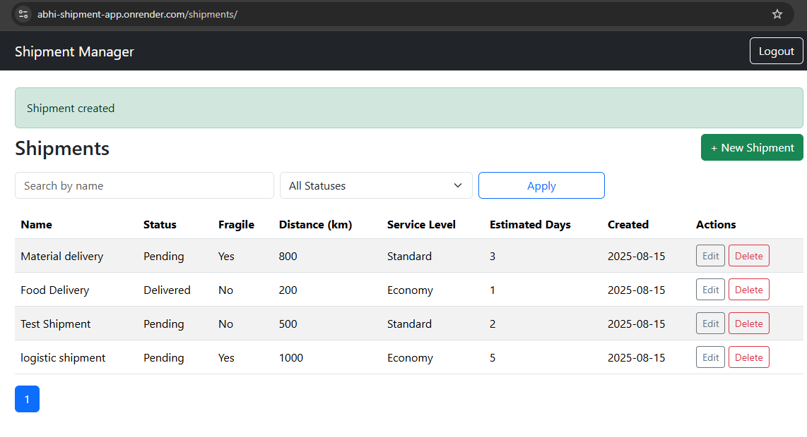

# Abhi's Shipment Management System (Flask)




A beginner-friendly mini app inspired by Shipsy. It includes:
- Username/password login (Flask-Login + bcrypt)
- Shipments CRUD (Create, Read, Update, Delete)
- Pagination & filtering
- Calculated field: `estimated_days` derived from `distance_km` and `service_level`

## Tech
- Backend: Flask + SQLite
- Frontend: HTML + Bootstrap (CDN)
- Deploy: Render (Procfile provided)

## Quick Start (Local on Windows/macOS/Linux)
1. Install Python 3.10+ and Git.
2. Create a virtual environment and install deps:
   ```bash
   python -m venv .venv
   # Windows
   .venv\Scripts\activate
   # macOS/Linux
   # source .venv/bin/activate

   pip install -r requirements.txt
   ```
3. Run the app:
   ```bash
   set FLASK_APP=app.py  # Windows (PowerShell: $env:FLASK_APP="app.py")
   set FLASK_DEBUG=1     # optional for dev
   python app.py
   ```
   The app will start on http://127.0.0.1:5000

4. Login with the seeded user:
   - username: **admin**
   - password: **admin123**


## Deployed to Render

The application is live and accessible at the following link:  
[Shipment App on Render](https://abhi-shipment-app.onrender.com/)

**Test Credentials**:  
- **Username:** `admin`  
- **Password:** `admin123`  

## API Documentation (Postman)

A Postman collection is included to test the live API endpoints of the Shipment App.  
You can import it into Postman to explore and run the APIs without typing URLs manually.

- **Postman Collection:** [`/docs/shipment_postman_collection.json`](docs/shipment_postman_collection.json)

### How to Import into Postman
1. Open Postman (free download: [https://www.postman.com/downloads/](https://www.postman.com/downloads/)).
2. Click **Import** (top left).
3. Select the file `shipment_postman_collection.json` from the `/docs` folder,  
   or copy the GitHub **Raw** file link and paste it in Postman Import.
4. Use the provided requests to test:
   - **Login:** `admin` / `admin123`
   - CRUD operations
   - Filters & pagination

Use these credentials to log in and explore the application's features.


## Docs
- `docs/architecture.md`: overview & schema
- `docs/ai_prompts.md`: put at least 6 Gemini CLI prompts + outcomes
- `docs/commits.md`: paste hourly commit screenshots
- `docs/video.md`: link your 3–5 min demo video
